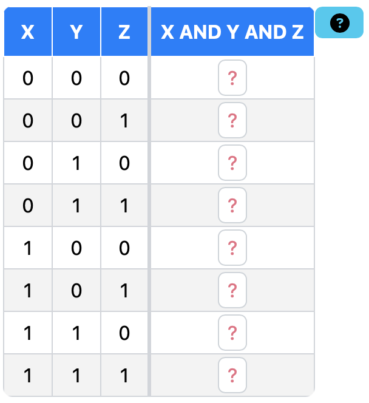

# PrairieLearn OER Element: Truth Table

This element was developed by Pai Zheng and Yujie Miao. Please carefully test the element and understand its features and limitations before deploying it in a course. It is provided as-is and not officially maintained by PrairieLearn, so we can only provide limited support for any issues you encounter!

If you like this element, you can use it in your own PrairieLearn course by copying the contents of the `elements` folder into your own course repository. After syncing, the element can be used as illustrated by the example question that is also contained in this repository.


## `pl-truth-table` element

This element creates a truth table and can be used for both instructional materials and questions. Input columns are auto-generated to enumerate all boolean combinations. Output columns are supplied as an attribute (either to be displayed or to be used for grading student inputs). The table supports both partial and all-or-nothing grading, different input alphabets (e.g., 0/1 or T/F), and custom bit widths (e.g., "011" as a single output column).

### Example



    ```html
    <pl-truth-table
        answers-name="q2"
        input-name="[X, Y, Z]"
        output-name="X AND Y AND Z"
        output-values="[0,0,0,0,0,0,0,1]"
    </pl-truth-table>>
    ```

### Element Attributes

| Attribute | Type | Description |
|-----------|------|-------------|
| `answers-name` | string (required) | Unique name for the element. |
| `input-name` | string (required) | Names of the input variables, displayed in the table header. For multiple input columns, wrap names in the style of an array (in square brakets and comma-seperated, e.g., `"[X, Y, Z]"`). |
| `output-name` | string (required) | Names of the input variables, displayed in the table header. For multiple input columns, wrap names in the style of an array (in square brakets and comma-seperated, `"[X OR Y, X AND Y]"`). |
| `bit-width` | string (default: `"1"`) | The expected number of bits for each output variable. Input the number as a string. |
| `is-material` | boolean (default: `false`) | If set to `true`, outputs are displayed and the table is static, to be used as instructor-provided material |
| `output-values` | string (required) | Output values for the table (displayed to students when `is-material=true`, and used for grading otherwise). Wrap values in the style of an array (in square brakets and comma-seperated, e.g., `"[0, 1, 1, 1]"`). For multiple output columns, separate each column's values by a comma (e.g., `"[0, 1, 1, 1], [0, 0, 0, 1]"`). The number of output columns must match the number of names provided in `output-name`, and the number of values per column must be 2^N for N input columns. |
| `input-alphabet` | string (default: `10`) | The characters used to represent true and false. Set `input-alphabet="TF"` to use T and F, or `input-alphabet="tf"` to use t and f. Note that the alphabet used in `output-values` has to match the one set here. |
| `placeholder` | string (default: `?`) | The placeholder shown for empty input boxes. |
| `prefill` | string (default: `0`) | A value prefilled for all input boxes (useful for large but sparsely filled tables). |
| `show-partial-score` | boolean (default: `true`) | Shows row-by-row grading feedback via a badge next to the each row. |
| `show-percentage-score` | boolean (default: `true`) | Assigns a percentage score for the question that is displayed as a badge. If set to `false`, all-or-nothing grading is used. |

